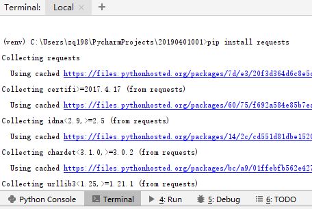

# Python

## 1.排错

### ModuleNotFoundError: No module named 'requests'

由于Pycharm新建项目的时候是在虚拟环境中运行解释器，所以没有安装Requests。

解决办法：在Pycharm中打开，执行pip install requests



### indexerror: list index out of range

一般列表是空的未读取到数据的情况会报此错误。

解决办法：在处理数据之前加入判断条件

```python
def get_contents(self, target):
    req = requests.get(url=target)
    html = req.text
    bf = BeautifulSoup(html,"html.parser")
    texts = bf.find_all('div', class_='showtxt')
    if(len(texts)):
        print(texts[0])
        texts = texts[0].text.replace('\xa0' * 8, '\n\n')
    else:
        dl.get_contents(target)
    return texts
```


## 2.笔记

* 通过Requests.get\(\)获取网页的HTML信息
* 通过beautifulsoup4解析HTML信息，find\_all匹配的返回的结果是一个列表。提取匹配结果后，使用text属性，提取文本内容，滤除br标签。随后使用replace方法，剔除空格，替换为回车进行分段。`&nbsp;`在html中是用来表示空格的。`replace('\xa0'*8,'\n\n')`就是去掉下图的八个空格符号，并用回车代替
* 一般静态页面的正文部分的标签是“showtxt”

